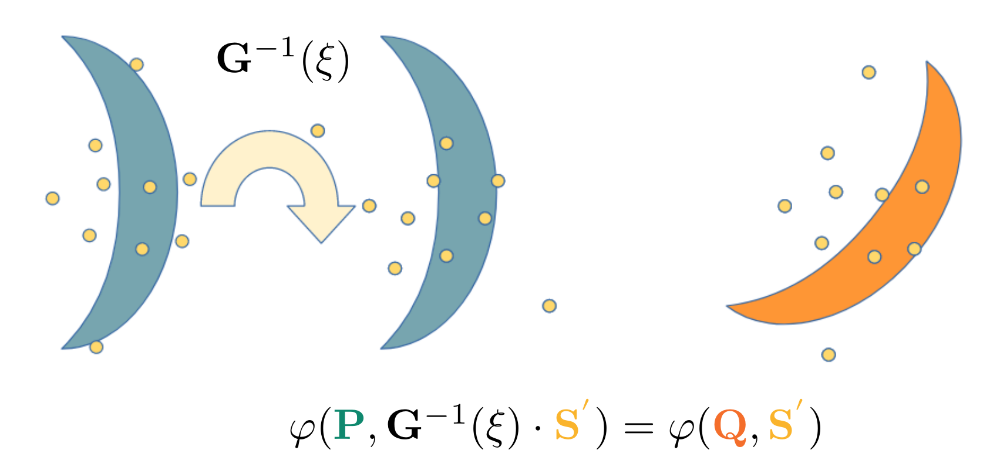

# Indirect Point Cloud Registration: Aligning Distance Fields using a Pseudo Third Point Set 

[Preprint](web)   |   [Supplementary](./assets/sup.pdf)



If you find this work interesting, please cite us:
```
@article{yuan2022indirect,
  title={Indirect Point Cloud Registration: Aligning Distance Fields using a Pseudo Third Point Set },
  author={Yuan, Yijun and N{\"u}chter, Andreas},
  journal={IEEE Robotics and Automation Letters},
  year={2022},
  publisher={IEEE}
}
```

## Install
```
conda create -n ifr_exp python=3.6
conda activate ifr_exp

pip install -r requirements.txt
```


## Quick Demo & How to use
For fast run, we provide a jupyter notebook for registration demo.
Please find **./demo/test\_toysample.ipynb**

You may need ```jupyter nbextension enable --py --sys-prefix widgetsnbextension``` to enable the ipyvolume plot in notebook

Then ```jupyter notebook```

So in that [notebook](./demo/test_toysample.ipynb), you can find the usage
```
from ifr import IFR
ifr_model = IFR(*param)
T = ifr.register(p0,p1)[0,:,:] # register p1 (source) to p0 (target)

```

## Dataset & Test
The following is related to experiment in paper.

The test script are highly compatible to [PointNetLK-Re](https://github.com/Lilac-Lee/PointNetLK_Revisited) tests. Please follow [repo](https://github.com/Lilac-Lee/PointNetLK_Revisited) for preparing dataset.

Afterwards, for testing, please find **./scripts/**.
```
source ./scripts/modelnet.sh
source ./scripts/shapenet.sh
source ./scripts/3dmatch.sh
```

## Acknowlegement
This code is mostly on top of [PointNetLK-Re](https://github.com/Lilac-Lee/PointNetLK_Revisited).
We thank for the kind response of Xueqian Li.
